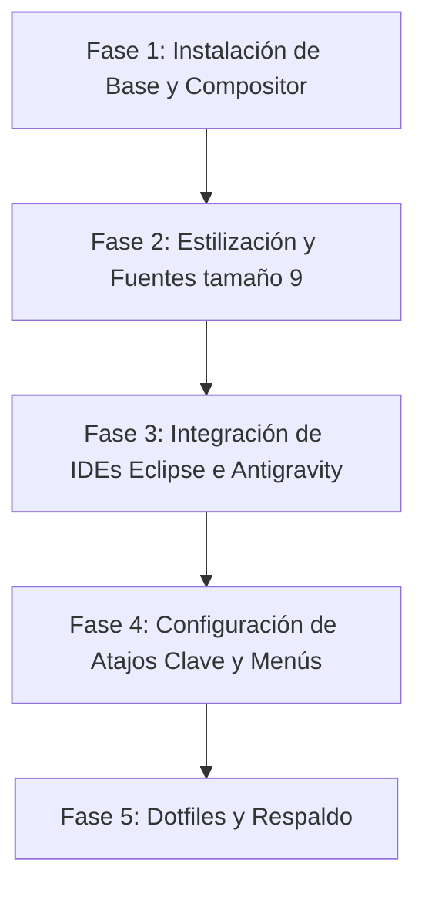

# Propuesta Seleccionada: Entorno Wayland Optimizado para Programador

Esta propuesta ha sido seleccionada y refinada específicamente para satisfacer tus requerimientos: **flujo de trabajo enfocado en programación, fácil de manejar, bordes finos, tipografía de tamaño 9, y compatibilidad perfecta con Eclipse y Antigravity IDE**.

Basándonos en la facilidad de manejo y la compatibilidad con IDEs complejos, la opción recomendada es **Hyprland** (o alternativamente **Sway** como opción ultra-directa), configurado con reglas específicas para ventanas de Eclipse y Electron.

---

## 🎨 Especificaciones Visuales y de Diseño

- **Tipografía del Entorno y Programación:** **SauceCodePro Nerd Font** a **8pt** (interfaces GTK 3/4) y **9pt** (Waybar, Rofi, Mako, Terminal). Glifos Nerd Font completos para iconos integrados en consola y barra. Alternativas recomendadas: **JetBrains Mono** y **Fira Code**.
- **Fuentes de Soporte:** **Noto Sans CJK** (caracteres asiáticos), **Noto Color Emoji** (emojis a color) y **FontAwesome** (iconografía complementaria).
- **Bordes de Ventana:** Bordes súper finos (`border_size = 1` o `2` máximo en la configuración de Hyprland). Esto proporciona un estilo elegante y minimalista sin desperdiciar píxeles.
- **Esquema de Colores:** **Catppuccin Mocha** (Fondo oscuro azulado/grisáceo con acentos lavanda y verde azulado) para reducir la fatiga ocular durante largas sesiones de codificación.

---

## 📂 Propuesta para el Manejo de Menús (Fácil de Usar)

Para que el acceso a tus aplicaciones sea intuitivo y rápido, proponemos un sistema híbrido que combina velocidad de teclado con comodidad visual:

### 1. Menú Visual por Categorías: `nwg-drawer` (Recomendado para exploración)
* **¿Qué es?** Un cajón de aplicaciones a pantalla completa (similar a GNOME o macOS) que agrupa tus aplicativos automáticamente por categorías (Desarrollo, Internet, Sistema, Gráficos, etc.).
* **¿Por qué usarlo?** Es ideal cuando no recuerdas el nombre exacto de una herramienta. Cuenta con una barra de búsqueda y botones rápidos para apagar/reiniciar.
* **Acceso:** Se puede vincular a la esquina superior izquierda de tu barra de tareas (**Waybar**) como un botón de "Inicio" o lanzarlo con `Super` + `M`.

### 2. Buscador de aplicaciones: `xfce4-appfinder`
* **¿Qué es?** Un buscador y lanzador de aplicaciones rápido y tradicional.
* **¿Por qué usarlo?** Permite buscar rápidamente cualquier aplicación instalada y ejecutar comandos de forma rápida.
* **Acceso:** Atajo `Super` + `D`.

### 3. Menú de Salida y Apagado Visual: `wlogout`
* **¿Qué es?** Un menú gráfico con botones grandes para bloquear pantalla, suspender, reiniciar, apagar o cerrar sesión. Evita tener que escribir comandos en consola.
* **Acceso:** Atajo `Super` + `Escape`.

---

## 🛠️ Configuración de Aplicaciones Clave para Programación

### 1. Antigravity IDE (Basado en VS Code/Electron)
Para que funcione de forma nativa en Wayland (evitando borrosidad por escalado y mejorando el rendimiento), se inicia con las siguientes flags de Ozone:
```bash
antigravity-ide --enable-features=UseOzonePlatform --ozone-platform=wayland --enable-wayland-ime
```

### 2. Eclipse IDE (Basado en SWT/GTK)
Eclipse utiliza la biblioteca SWT que se integra directamente con GTK. Para forzar a Eclipse a ejecutarse nativamente en Wayland y manejar adecuadamente los menús/popups:
- **Variable de Entorno:** `GDK_BACKEND=wayland`
- **Solución para ventanas no-reparentadas (Java/AWT):** `_JAVA_AWT_WM_NONREPARENTING=1` (previene pantallas grises en diálogos de Java).
- **Ejecución:**
  ```bash
  env GDK_BACKEND=wayland _JAVA_AWT_WM_NONREPARENTING=1 eclipse
  ```

### 3. Terminal Emulator: XFCE4-Terminal
Configurado con la tipografía en tamaño 9:
```ini
# ~/.config/xfce4/terminal/terminalrc
FontName=JetBrains Mono 9
ColorBackground=#1e1e2e
```

---

## ⚙️ Reglas de Ventana para "Fácil Manejo" (Hyprland / Sway)
Para que los entornos de desarrollo sean fáciles de usar, los menús emergentes, diálogos de confirmación y asistentes de Eclipse no deben "tilarse" (dividir la pantalla), sino flotar.

Añade estas reglas en tu archivo de configuración de Hyprland (`~/.config/hypr/hyprland.conf`):

```ini
# Bordes delgados
general {
    border_size = 1
    gaps_in = 3
    gaps_out = 5
    col.active_border = rgba(cba6f7ee) rgba(89b4faee) 45deg
    col.inactive_border = rgba(585b70aa)
}

# Tipografía del sistema en Waybar y notificaciones
# Configurar font-size: 9pt; en ~/.config/waybar/style.css

# Reglas de Eclipse para ventanas flotantes (asistentes, propiedades, diálogos)
windowrulev2 = float, class:^(Eclipse)$, title:^(.*)(Dialog|Properties|Preferences|Wizard|Settings|New|Open|Save).*$
windowrulev2 = float, class:^(Eclipse)$, title:^(Select).*$
windowrulev2 = float, class:^(Eclipse)$, title:^(Progress).*$

# Reglas para Antigravity IDE / VS Code
windowrulev2 = float, class:^(code-url-handler)$

# Reglas para xfce4-appfinder (Buscador flotante centrado)
windowrule = match:class ^(xfce4-appfinder)$, float true
windowrule = match:class ^(xfce4-appfinder)$, center true

# Reglas para LibreOffice / OpenOffice (Diálogos flotantes)
windowrule = match:class ^(soffice|libreoffice.*)$, match:title ^(Open|Abrir|Save|Guardar|Save As|Guardar como|Confirm|Properties|Choose|Select|Select a File|Seleccionar un archivo)$, float true
windowrule = match:class ^(soffice|libreoffice.*)$, match:title ^(Open|Abrir|Save|Guardar|Save As|Guardar como|Confirm|Properties|Choose|Select|Select a File|Seleccionar un archivo)$, center true
```

---

## 🛠️ Arquitectura del Sistema por Fases



### Fase 1: Base y Compositor
Instalación del sistema base (recomendamos **Fedora Workstation** si buscas estabilidad y facilidad para programar con Eclipse sin lidiar con dependencias rotas, o **Arch Linux** para máxima personalización).
- Instalar **Hyprland** (compositor) y **Waybar** (barra de tareas).
- Instalar **PipeWire** (audio).

### Fase 2: Estilización y Fuentes
- Configurar las fuentes a tamaño 9 en el sistema (**SauceCodePro Nerd Font 9** o **JetBrains Mono 9**) y en el terminal (**XFCE4-Terminal**).
- Estilizar la barra superior **Waybar** con tamaño 9 (`style.css`).
- Aplicar el tema Catppuccin Mocha (`catppuccin-mocha-lavender-standard+default`) en GTK 2, 3 y 4 con `settings.ini`, `.gtkrc-2.0` y reglas CSS compactas (`gtk.css`) para ajustar la altura de headerbars y márgenes al tamaño 9.
- Sincronizar esquemas de Wayland mediante GSettings (`org.gnome.desktop.interface`) para garantizar coherencia en Eclipse, Thunar, diálogos nativos y aplicaciones Flatpak.


### Fase 3: Integración de Eclipse y Antigravity IDE
- Crear accesos directos en el sistema (`.desktop` files) con las variables de entorno para que Eclipse y Antigravity IDE se ejecuten nativamente en Wayland.
- Aplicar las reglas de ventana de Hyprland detalladas arriba para garantizar que los popups floten.

### Fase 4: Atajos de Teclado del Desarrollador (Keyboard Shortcuts)
Diseñados para interactuar fácilmente sin despegar las manos del teclado:

| Atajo | Acción | Para qué se usa |
| :--- | :--- | :--- |
| `Super` + `Enter` | Lanzar Terminal (**XFCE4-Terminal** a tamaño 9) | Escribir comandos y scripts |
| `Super` + `Q` | Cerrar ventana activa | Limpiar el espacio de trabajo |
| `Super` + `F` | Pantalla completa (Fullscreen) | Concentración máxima en Eclipse / Antigravity |
| `Super` + `Espacio` | Cambiar ventana activa a Flotante | Mover libremente ventanas de Eclipse |
| `Super` + `D` | Buscador (**xfce4-appfinder**) | Buscar y abrir aplicaciones instantáneamente |
| `Super` + `M` | Menú Visual por Categorías (**nwg-drawer**) | Navegar visualmente entre las aplicaciones |
| `Super` + `Escape` | Menú de Salida (**wlogout**) | Apagar, reiniciar o suspender visualmente |
| `Super` + `H/J/K/L` | Mover foco de ventana | Navegación rápida entre código y terminal |
| `Super` + `1` al `5` | Ir al espacio de trabajo (workspace) | Dividir tareas (Ej: 1: Navegador, 2: IDEs, 3: Terminales) |

### Fase 5: Dotfiles y Respaldos
- Empaquetar la configuración en un repositorio Git para que, si reinstalas el sistema, puedas recuperarla en segundos.
